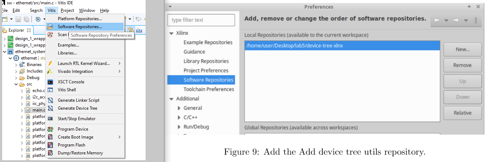

# zynq7000_linux
This repository contains how to boot linux on a zynq

## Set up
Clone U-Boot Second Stage BootLoader (SSBL)
```plaintext
git clone https://github.com/xilinx/u-boot-xlnx.git
```
Checkout fixed version (Vivado version)
```plaintext
cd u-boot-xlnx && git checkout xilinx-v<version(2022.2 2023.2 ...)> && cd ..
```
Clone Device tree utilities
```plaintext
git clone https://github.com/xilinx/device-tree-xlnx.git
```
Checkout fixed version (Vivado version)
```plaintext
cd device-tree-xlnx && git checkout xilinx_v<version(2022.2 2023.2 ...)> && cd ..
```
Install the device tree compiler
```plaintext
sudo -H apt-get install device-tree-compiler
```
Prepare the environment (**if you open a new console you will have to export the environment again**)
```plaintext
export CROSS_COMPILE=arm-linux-gnueabihf-
source /tools/Xilinx/Vivado/2022.2/settings64.sh
```

## Generate your Vivado Zynq project:
  - Generate the bitstream.
  - Export hardware (.xsa file).

## Generate your FSBL with VITIS IDE (fsbl.elf)
The FSBL is responsible for loading the bitstream and configuring the Zynq PS al boot time.
1. Create a new platform project using the exported hardware XSA from Vivado.
      
    Select Zynq FSBL
    
2. Modify the BSP settings for the standalone OS to include the xilffs library.
    - Add xilffs library  
      
    
3. Build BSP sources.
4. Create a new application project (name it fsbl) on top of the platform that we have just created,
    selecting Zynq FSBL as the application template.
5. Change the C/C++ Build Settings for the FSBL application (See Figure 7) to include FSBL_DEBUG_INFO.
    This allows the FSBL to print debug messages during the boot process.
    - Add xilffs library  
      
    
6. Build the FSBL application.

## Generate device tree blob with Vitis (devicetree.dtb)
1. Add device tree utils repo: In Xilinx tab, select Vitis -> Software Repositories and add it.
    Add device tree utils repo.
    
2. Refresh repositories: In Xilinx, Vitis -> Scan Repositories.
3. Generate device tree: In Xilinx, Vitis -> Generate Device Tree.
4. Apply now the C/C++ preprocessor to handle includes:
```plaintext
"$CROSS_COMPILE"gcc -E -nostdinc -x assembler-with-cpp -o "path/out.dts" "path/in.dts"
```
5. Compile now the device tree:
```plaintext
dtc -I dts -O dtb -o "path/out.dtb" "path/in.dts"
```

## Build the U-Boot: (u-boot.elf)
  - Place the DTS file in the path: u-boot-xlnx/arch/arm/dts/$(board-name).dts
  - Add the DTB path name to the Makefile: u-boot-xlnx/arch/arm/dts/Makefile under dtb-$(CONFIG_ARCH_ZYNQ) group += \ -> $(board-name).dtb
  - Add to u-boot-xlnx/configs/xilinx_zynq_virt_defconfig: under CONFIG_OF_LIST label -> CONFIG_OF_LIST="..... $(board-name)"
```plaintext
export DEVICE_TREE=$(board-name)
```
```plaintext
export CROSS_COMPILE=arm-linux-gnueabihf-
source /tools/Xilinx/Vivado/2022.2/settings64.sh
make xilinx_zynq_virt_defconfig
make -j $(nproc)
```

## Build Linux kernel (uImage)
  - [Build linux kernel from sources](sources/README.md)
  - [Build linux kernel buildroot](buildroot/README.md)

## Generate the boot image (BOOT.bin)
To create a boot image, you can use the Create Boot Image wizard in the Vitis IDE or the Bootgen
command line tool (the Create Boot Image Wizard also calls the Bootgen tool). The principle function
of the Create Boot Image wizard or Bootgen is to integrate the partitions (hardware-bitstream and
software) in the proper format. It allows you to specify security options and also to create cryptographic
keys.
Functionally, Bootgen uses a BIF (Bootgen image format) file as an input and generates a single
file image in binary BIN or MCS format. It can program non-volatile memories such as QSPI and SD
cards. The Bootgen GUI facilitates the creation of a BIF input file.
In this case, we will use the Vitis IDE again to create the boot image. We must follow this
procedure:
1. Go to Xilinx, Create boot image, Zynq and Zynq Ultrascale.
2. Select architecture ”Zynq”, make sure that ’Create new BIF file’ is checked, and set ”/path_to/lab5.bif” as the ’Output BIF file path’.
3. In the boot image partitions:
    - Add FSBL executable (”/path_to/fsbl.elf”) as bootloader.
    - Add PL bitstream (”/path_to/system wrapper.bit”) as datafile.
    - Add U-Boot executable (”/path_to/u-boot.elf”) as datafile. All those
4. Click on ’Create Image’

## Format SD card
We will now format the SD card by creating the two partitions required for the boot process: one for the boot files and one for the file system. 
In GParted, perform the following steps:
1. Locate the SD card in the drop-down menu on the upper right. Typically, it will be /dev/sdb
2. Delete all partitions. If this option is not enabled, you must unmount each partition first.
3. Create a 100 MiB fat32 partition at the beginning of the drive. Use BOOT as label.
4. Create an ext4 partition right after the fat32 one, leave 100 MiB free after. Use rootfs as label.
5. Apply all operations using the green tick icon in gparted.
6. Close GParted.
    

## Format SD card
### First partition
Coppy to the first partition:
 - BOOT.bin
 - devicetree.dtb
 - uImage
 - [extlinux/extlinux.conf](extlinux/extlinux.conf)

### Second partition rootfs
  - **Linaro**

    Download the root filesystem from Linaro repository:
    ```plaintext
    wget https://releases.linaro.org/debian/images/developer-armhf/17.08/linaro-stretch-developer-20170706-43.tar.gz
    ```
    Mount second SD card partition (replace /dev/sdb2 with your local /dev/sdX2 device)
    ```plaintext
    sudo -H mount /dev/sdb2 /mnt
    ```
    Extract root file system onto the second SD card partition
    ```plaintext
    sudo -H tar --strip-components=1 -xzvphf "/home/user/Desktop/lab5/linaro-stretch-developer-20170706-43.tar.gz" -C /mnt
    sync
    ```
    Unmount the second SD card partition
    ```plaintext
    sudo -H umount /mnt
    ```
  - [Buildroot](buildroot/README.md)
  - [Debootstrap](Debootstrap/README.md)